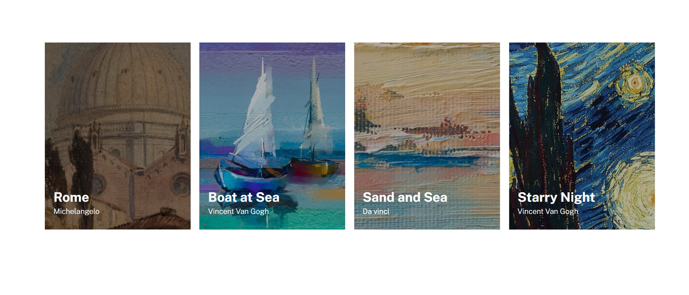

# README - Exercício Avançado CSS - FLEX - 04 - Lista de Imagens
Estudo de caso FLEX. Desenvolvimento de Layout de Lista de Imagens. Usamos no projeto linguagem HTML e CSS. Fizemos um projeto responsivo, levando-se em consideração o uso do mesmo site em dispositivos móveis ou dispositivos com telas pequenas. 🚀🚀 

Abaixo estão as imagens e gif´s do site que foi reproduzido:

[]

[]

- GIF Layout´s Esperados
[]

Abaixo estão as imagens dos layout´s feita por mim. Tentei ser o mais fiel possível:

- Layout Desktop
[]

- Layout Mobile
[]

## Tecnologias Utilizadas
- HTML
- CSS

## Desafios
Tivemos dificuldade no momento de fazer a reponsividade com relação aos textos que sobrepõem as imagens. Resolvemos isso fixando o TOP para cada imagem.
